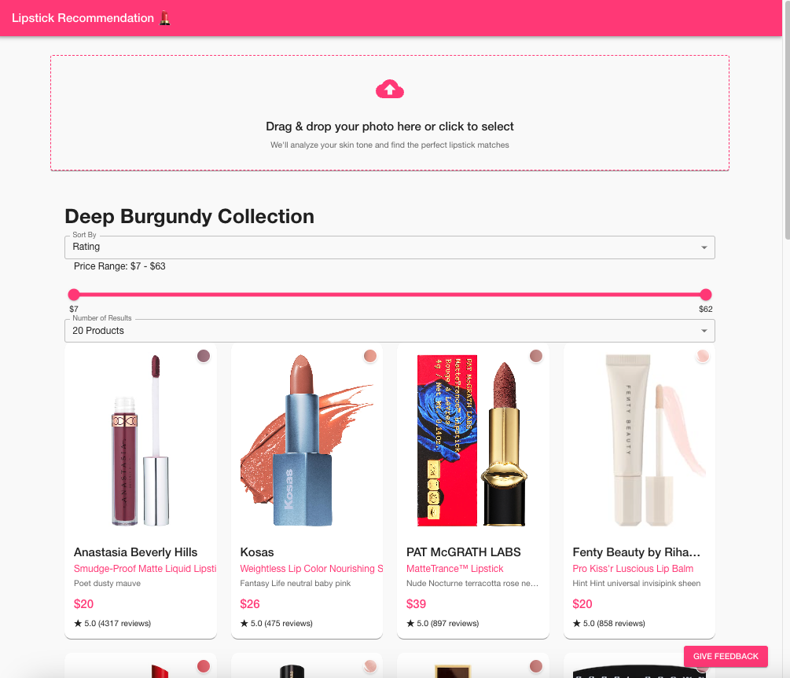
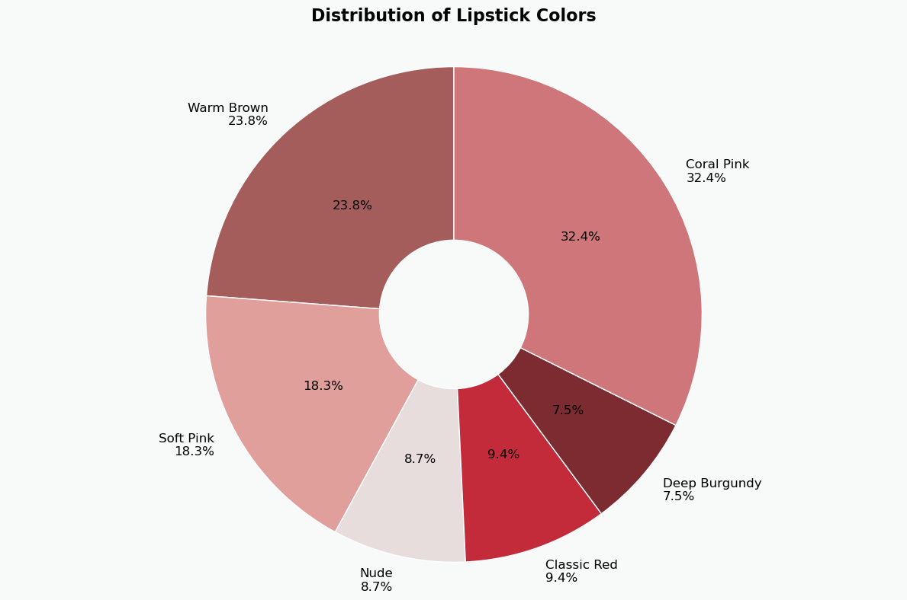

# Lipstick Recommendation 💄

> An AI-powered web application that recommends personalized lipstick colors and brands based on user-uploaded images.

## 🌟 Overview

Lipstick Recommendation System is a Docker-based application that leverages image processing and machine learning to provide customized lipstick recommendations. Users can upload photos through an intuitive web interface, receive instant color and brand suggestions, and provide feedback to help improve future recommendations.

## ✨ Key Features

- 🖼️ **Smart Image Upload**: Seamless photo upload experience with instant processing
- 🎨 **Intelligent Color Analysis**: Advanced image processing for accurate color recommendations
- 💄 **Brand Matching**: Matches your perfect shade with available products
- 📊 **User Feedback System**: Collects and analyzes user ratings for continuous improvement
- 🔄 **Containerized Architecture**: Fully dockerized for consistent deployment and scaling



## 🛠️ Tech Stack

- **Frontend**: React.js
- **Backend**: Python Flask
- **Database**: MySQL
- **Containerization**: Docker & Docker Compose

### Key Libraries
- Frontend: Axios, React Router, Material-UI
- Backend: Flask-CORS, Pillow, MySQL Connector/Python

## 🚀 Getting Started

### Prerequisites

- Docker Engine (version 20.10.0 or higher)
- Docker Compose (version 2.0.0 or higher)
- Git

### Installation

1. Clone the repository
```bash
git clone https://github.com/Shubin-Luan-Umich/SIADS699_Capstone_FA24_Team23.git
```

2. Launch the application
```bash

   # Clean up old containers and images
   docker-compose down
   docker system prune -f

   # Delete node_modules
   rm -rf frontend/node_modules

   # Rebuild and start containers
   docker-compose up --build

```

3. Access the application at [http://localhost:3000](http://localhost:3000)

## 📊 Data Architecture

### 💾 Data Schema

| Field Name | Type | Description | Example |
|------------|------|-------------|----------|
| Brand | string | Cosmetics brand name | "Anastasia Beverly Hills" |
| Name | string | Product display name | "Liquid Lipstick" |
| Color Description | string | Color description | "American Doll classic blue red" |
| Color Cluster | integer | Color group (0-5) | 3 |
| RGB | string | RGB color value | "rgb(149,19,44)" |
| Rating | float | User rating (1-5) | 4.5 |
| Reviews | integer | Number of user reviews | 1250 |
| Price | integer | Product price | 20 |
| URL | string | Product URL | "https://www.sephora.com/..." |
| Cover Image | string | Base64 encoded cover image | (base64 string) |
| Lipstick Image | string | Base64 encoded lipstick image | (base64 string) |
| Recommendation Score | float | Overall score (0-100) | 85.67 |

### 🎨 Color Clusters

1: Warm Brown, 
2: Soft Pink, 
3: Nude, 
4: Classic Red, 
5: Deep Burgundy, 
6: Coral Pink



### 🧮 Recommendation Score Calculation
```python
def calculate_recommendation_score(rating, reviews, max_reviews):
    # Rating component (70% weight)
    rating_score = rating / 5.0

    # Review component (30% weight)
    review_score = np.log1p(reviews) / np.log1p(max_reviews)

    # Final score
    final_score = (0.7 * rating_score + 0.3 * review_score) * 100
    return round(final_score, 2)
```

## 📱 Usage Guide

### 1. Upload Your Photo
- Click the upload button or drag & drop your photo

### 2. Get Recommendations
- View your processed image
- Receive personalized lipstick color recommendations
- Browse matching product suggestions

### 3. Provide Feedback
- Rate your experience (1-5 stars)
- Share detailed feedback (optional)
- Help improve future recommendations

## 📁 Project Structure

```
lipshade-lab/
├── docker-compose.yml          # Container orchestration
├── frontend/                   # Frontend React application
│   ├── Dockerfile              # Frontend container configuration
│   ├── package.json            # Node.js dependencies
│   ├── public/
│   │   └── index.html
│   └── src/
│       ├── index.js
│       ├── App.js
│       ├── contexts/
│       │   └── ImageContext.js
│       ├── components/
│       │   ├── ImageUpload.js
│       │   ├── RecommendationView.js
│       │   └── FeedbackDialog.js
│       └── theme.js
│
├── backend/                    # Backend Flask application
│   ├── Dockerfile              # Backend container configuration
│   ├── requirements.txt        # Python dependencies
│   ├── models/
│   │   └── sephora_lipstick_clustering_model.pkl
│   ├── data/
│   │   └── lipstick_recommendation_dataset.csv
│   ├── feedback_handler.py
│   ├── image_processor.py
│   ├── lipstick_recommender.py
│   └── models.py
└── mysql
```

## 🔮 Future Roadmap

- 🔐 **User Authentication**: Personal accounts and history tracking
- 🎨 **Enhanced UI/UX**: More intuitive and responsive design
- 📱 **Mobile App**: Native mobile applications
- 🤖 **Advanced AI**: Improved color detection and matching
- ☁️ **Cloud Deployment**: Scalable cloud infrastructure

## 👥 Contributing

We welcome contributions! Please feel free to submit a Pull Request.

## 📬 Contact

For questions or feedback, please contact our team:

- Shubin Luan - shubinl@umich.edu

---
Built with ❤️ by Team 23 | SIADS699 Capstone Project FA24